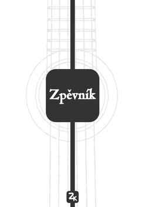
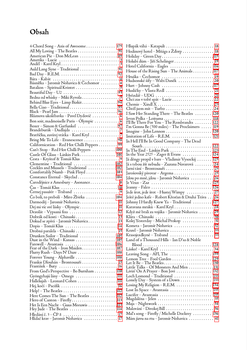
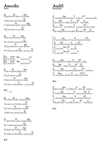

# Songbook

  

My personal guitar songbook. Made with the [songs](http://songs.sourceforge.net) LaTeX package. Contains 234 songs in Czech, English and other languages.

:czech_republic: :us: :uk: :slovakia: :fr: :de: :netherlands: :it: :hungary: :ru: :serbia: :finland: :poland:

You can either download the **compiled [PDF](https://github.com/kasnerz/songbook/raw/master/songbook.pdf)** or 
build it by yourself from source.

The current version was completed in July 2022 and exists also as a (unique) printed copy.

[Here](https://github.com/kasnerz/chords2latex) is the script I am using for converting chords to LaTeX.

Feel free to use for personal purposes.

