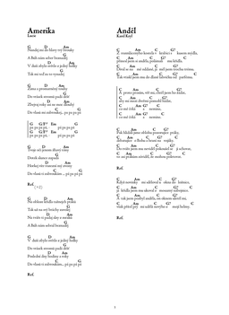

# Songbook

  

[![Download PDF]][https://github.com/kasnerz/songbook/raw/master/songbook.pdf]

My personal guitar songbook. Contains 320 songs in Czech, English, and other languages.

:czech_republic: :us: :uk: :slovakia: :fr: :de: :netherlands: :it: :hungary: :ru: :serbia: :finland: :poland: :ukraine:

The songbook consists of two parts: 
- the first part exists as a printed version (compiled in July 2022),
- the second one is currently under preparation and exists only in the digital form.

In this branch, both parts are merged in the single PDF. If you want to access the original (printed) version, you can do it in the `part-1` branch (here is the link to the [PDF](https://github.com/kasnerz/songbook/raw/part-1/songbook.pdf)).

For building it by yourself from source, make sure you have TeX Live installed and then use the
`latexmk` command.

The songbook is made with the [songs](http://songs.sourceforge.net) LaTeX package. 

[Here](https://github.com/kasnerz/chords2latex) is the script I am using for converting chords to LaTeX.

Feel free to use for personal purposes :wink:

